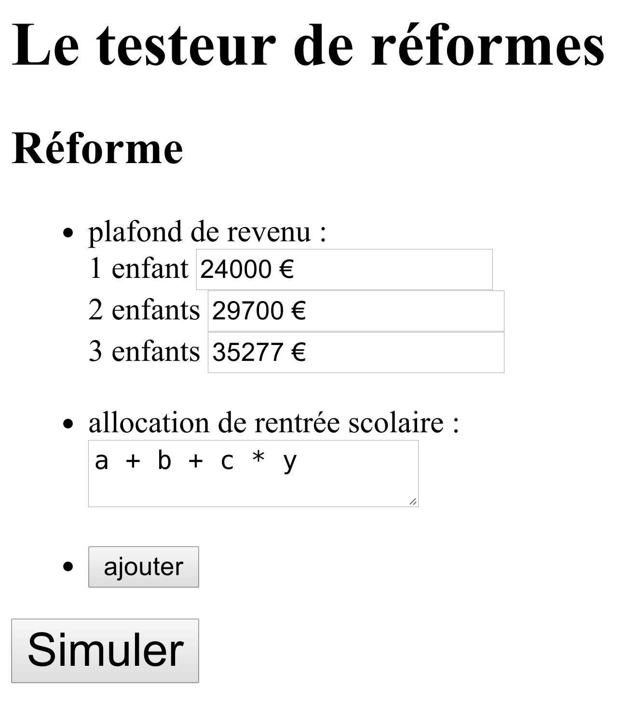

title: OpenFisca à la CNAF
author:
  name: Merci, l'équipe OpenFisca - Hack'allocs
  url: https://github.com/cbenz/openfisca-hackallocs
output: slides.html

--

# Simulation socio-fiscale
## avec OpenFisca à la CNAF

--

### OpenFisca

- 1 modèle ouvert de la législation socio-fiscale
- contributif / logiciel libre / dév. sur github
- outil neutre pour un débat public apaisé / éclairé

http://www.openfisca.fr/

http://ui.openfisca.fr/

--

### Utilisateurs

- chercheurs
- élus locaux
- data journalists
- agent public d'une administration
- citoyen éclairé
- société civile (associations, think tanks)
- partis politiques
- cabinets ministériels / Parlement

--

### Jusqu'ici

- OpenFisca simule des *cas types*
- permet de simuler des *réformes*

--

### Objectif du hackathon

Faire tourner OpenFisca sur des données réelles
- valider les calculs d'Open Fisca
- permettre à tous de quantifier les effets *réels* de réformes, en garantissant l'anonymat en sortie

exemple : [le calcul de l'allocation de rentrée scolaire](http://legislation.openfisca.fr/variables/ars)

--

--

--

### Entrer une réforme

--

### Voir l'effet sur trois axes

- Sur les allocataires
- Sur les finances publiques
- Sur les inégalités

### L'effet sur les allocataires

Etre capable de les décomposer :
- Sur les personnes affectées/gagnantes/perdantes
- Sur les allocataires de la Meuse
- Sur les couple avec trois enfants

--

### Analyse

--
### Nos souhaits

- après l'ouverture http://data.caf.fr/
- l'ouverture http://openfiscaf.fr/
- organiser une journée de dév. interne CNAF
- itérer sur le testeur de réformes

--
### Rien à voir mais ...

--
### Communiquez vos travaux
- sur le wiki
- en envoyant un mail à hackathon@data.gouv.fr
- sur data.gouv.fr dans la partie réutilisation des données de la CNAF
- en venant me voir pendant que le jury délibère

--
### Déjà envie de remettre ça ?
Dans deux semaines, un hackathon d'une journée sur des thèmes variés
- Se déplacer
- Se former
- S'alimenter
- S'engager

 
